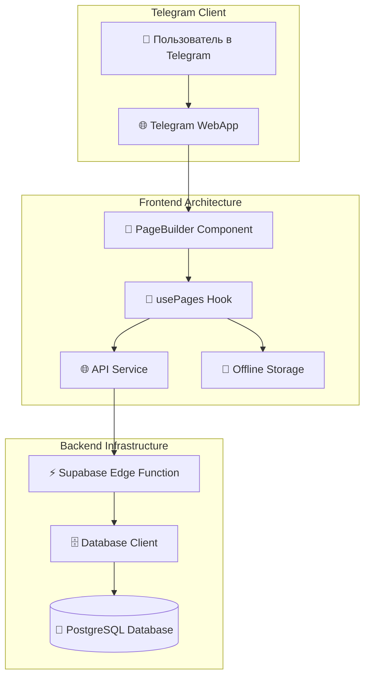
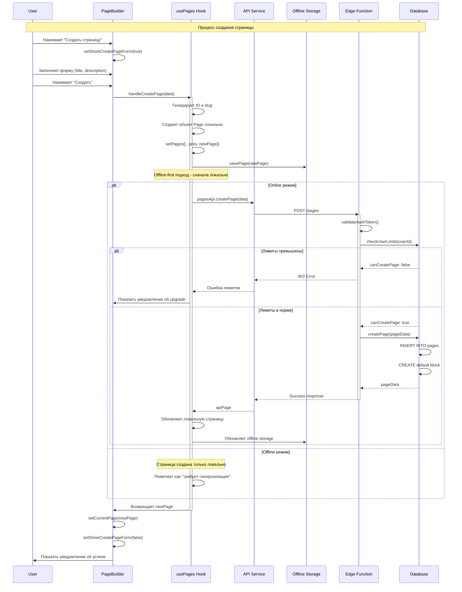
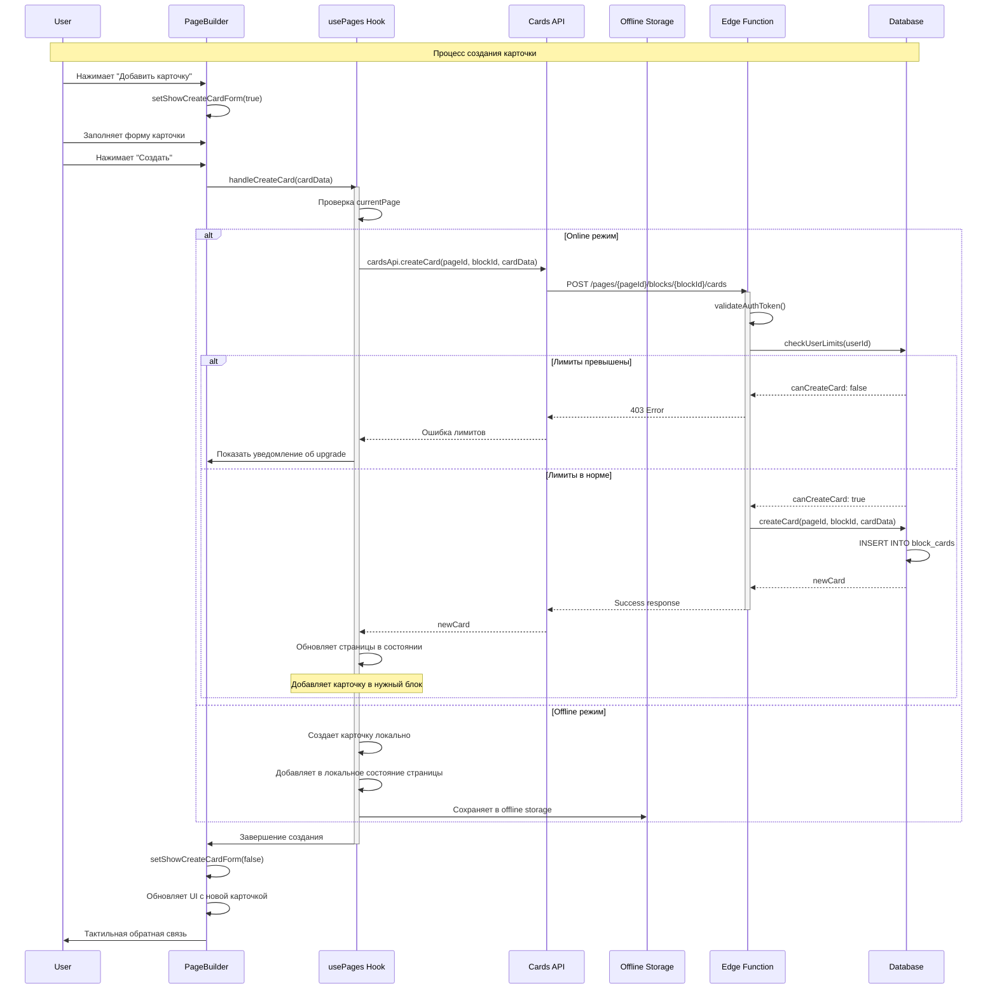
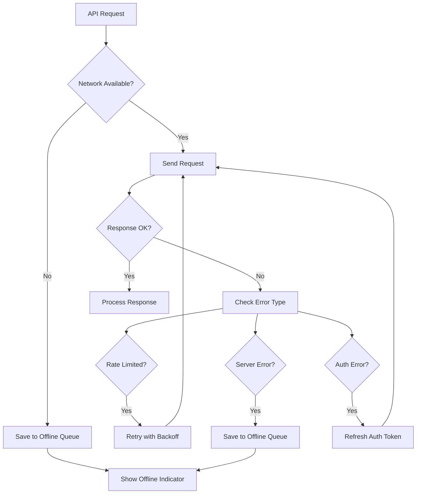
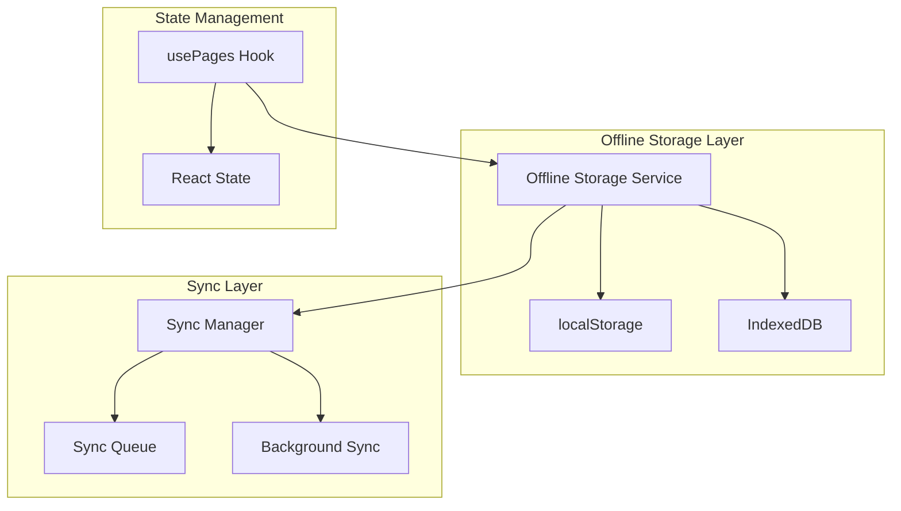
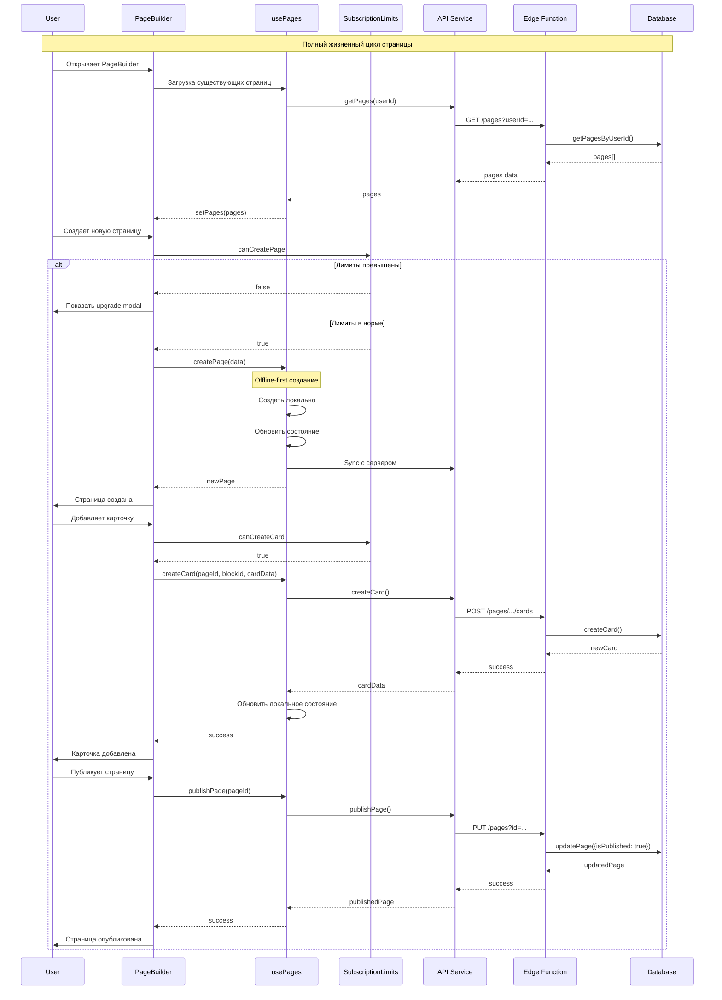
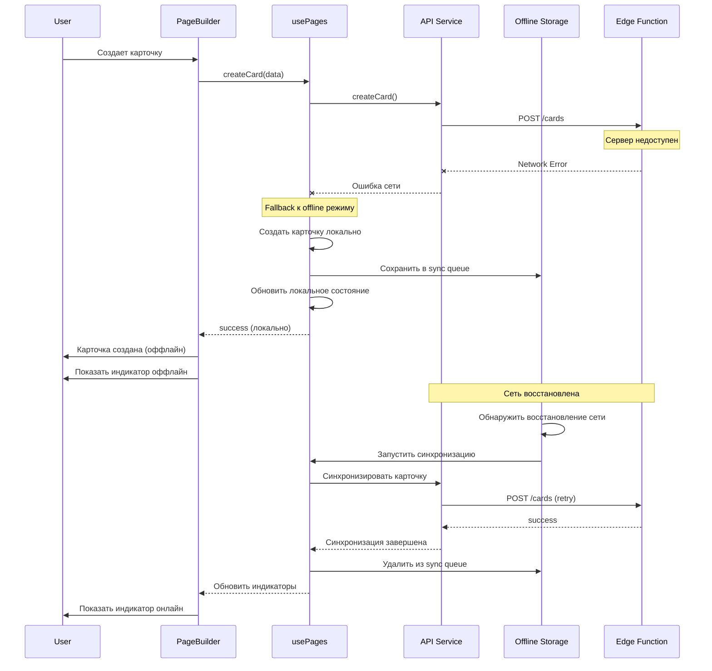

# Page and Card Creation Architecture

## Обзор

Этот документ описывает полную архитектуру системы создания страниц и карточек в Telegram Mini App "Navigapp". Система построена на современном стеке технологий с акцентом на offline-first подход и оптимальный пользовательский опыт.

## 1. Архитектура системы

### 1.1 Общий обзор системы



### 1.2 Ключевые компоненты

| Компонент | Ответственность | Технология |
|-----------|----------------|------------|
| **PageBuilder.tsx** | UI-компонент для создания страниц и карточек | React 18, TypeScript |
| **usePages.ts** | Бизнес-логика управления страницами | Custom React Hook |
| **api.ts** | HTTP-клиент для работы с API | Fetch API |
| **database.ts** | Работа с базой данных | Supabase Client |
| **index.ts** | Edge Function API endpoints | Deno Runtime |

## 2. Процесс создания страницы

### 2.1 UML диаграмма последовательности создания страницы



### 2.2 Детальный алгоритм создания страницы

#### Фронтенд (PageBuilder.tsx)

```typescript
const handleCreatePage = async (data: CreatePageData) => {
  console.log('🔥 PageBuilder: Starting page creation');
  setIsLoading(true);

  try {
    // 1. Вызов hook для создания страницы
    const newPage = await createPage(data);

    // 2. Обновление UI состояния
    setCurrentPage(newPage);
    setShowCreatePageForm(false);

    // 3. Показ уведомления пользователю
    addToast({
      type: 'success',
      title: 'Страница создана',
      message: `Страница "${data.title}" успешно создана`
    });

    // 4. Тактильная обратная связь в Telegram
    if (hapticFeedback) {
      hapticFeedback('impact', 'medium');
    }
  } catch (error) {
    // Обработка ошибок с детальным логированием
    console.error('🔥 PageBuilder: Error creating page:', error);
    // ... error handling
  }
};
```

#### Бизнес-логика (usePages.ts)

```typescript
const createPage = async (data: CreatePageData): Promise<Page> => {
  try {
    // 1. Валидация входных данных
    if (!data || typeof data !== 'object') {
      throw new Error('Invalid page data provided');
    }

    // 2. Создание локального объекта страницы (offline-first)
    const newPage: Page = {
      id: generateSimpleId(),
      title: data.title?.toString?.() || 'Untitled Page',
      description: data.description?.toString?.() || '',
      slug: generateSlug(title),
      isPublished: false,
      blocks: [createDefaultBlock()], // Создается базовый блок
      createdAt: new Date().toISOString(),
      updatedAt: new Date().toISOString()
    };

    // 3. Немедленное обновление локального состояния
    setPages(prev => [...prev, newPage]);

    // 4. Сохранение в offline storage
    offlineStorage.savePage(newPage);

    // 5. Попытка синхронизации с API (если онлайн)
    if (offlineStorage.getIsOnline()) {
      try {
        const apiPage = await pagesApi.createPage({ ...data, userId });
        // Обновляем локальные данные данными с сервера
        setPages(prev => prev.map(p =>
          p.id === newPage.id ? { ...apiPage, id: newPage.id } : p
        ));
        offlineStorage.savePage({ ...apiPage, id: newPage.id });
      } catch (apiError) {
        // API недоступен, но страница уже создана локально
        console.warn('API sync failed, but page created locally');
      }
    }

    return newPage;
  } catch (error) {
    // Fallback механизм - создаем минимальную страницу
    const fallbackPage = createFallbackPage();
    setPages(prev => [...prev, fallbackPage]);
    return fallbackPage;
  }
};
```

#### Бэкенд API (index.ts)

```typescript
// POST /pages endpoint
if (req.method === 'POST') {
  const body = await req.json();

  // 1. Проверка лимитов пользователя
  const limits = await db.checkUserLimits(body.userId);
  if (!limits.canCreatePage) {
    return new Response(JSON.stringify({
      success: false,
      error: {
        message: 'Page limit reached. Upgrade to Pro for unlimited pages.',
        code: 'PAGE_LIMIT_REACHED',
        currentCount: limits.currentPageCount,
        maxAllowed: limits.isPro ? 'unlimited' : 1
      }
    }), { status: 403 });
  }

  // 2. Создание страницы в базе данных
  const newPage = await db.createPage({
    userId: body.userId,
    title: body.title,
    description: body.description,
    slug: body.slug
  });

  return new Response(JSON.stringify({
    success: true,
    data: newPage
  }));
}
```

## 3. Процесс создания карточки

### 3.1 UML диаграмма последовательности создания карточки



### 3.2 Детальный алгоритм создания карточки

#### Фронтенд (PageBuilder.tsx)

```typescript
const handleCreateCard = async (data: CreateCardData) => {
  if (!currentPage) {
    console.error('🔥 No current page found');
    return;
  }

  setIsLoading(true);

  try {
    // 1. Получение ID блока (первый блок страницы)
    const blockId = currentPage.blocks[0].id;

    // 2. Создание карточки через API
    const newCard = await createCard(currentPage.id, blockId, data);

    // 3. Обновление локального состояния страницы
    const updatedPage = pages.find(p => p.id === currentPage.id);
    if (updatedPage) {
      setCurrentPage(updatedPage);
    }

    // 4. Закрытие формы и обратная связь
    setShowCreateCardForm(false);
    if (hapticFeedback) {
      hapticFeedback('impact', 'light');
    }
  } catch (error) {
    console.error('🔥 Error creating card:', error);
    // Обработка ошибок
  } finally {
    setIsLoading(false);
  }
};
```

#### Бизнес-логика (usePages.ts)

```typescript
const createCard = async (pageId: string, blockId: string, cardData: CreateCardData): Promise<Card> => {
  try {
    if (offlineStorage.getIsOnline()) {
      // Online режим: создание через API
      const newCard = await cardsApi.createCard(pageId, blockId, cardData);

      // Обновление локального состояния
      setPages(prev => prev.map(page => {
        if (page.id === pageId) {
          return {
            ...page,
            blocks: page.blocks.map(block => {
              if (block.id === blockId) {
                return {
                  ...block,
                  cards: [...block.cards, newCard]
                };
              }
              return block;
            }),
            updatedAt: new Date().toISOString()
          };
        }
        return page;
      }));

      return newCard;
    } else {
      // Offline режим: создание локально
      const newCard: Card = {
        id: Date.now().toString(),
        title: cardData.title,
        description: cardData.description,
        iconName: cardData.iconName,
        iconUrl: cardData.iconUrl,
        url: cardData.url,
        type: cardData.type,
        order: 0
      };

      // Обновление локального состояния и storage
      setPages(prev => prev.map(page => {
        if (page.id === pageId) {
          const updatedPage = {
            ...page,
            blocks: page.blocks.map(block => {
              if (block.id === blockId) {
                return {
                  ...block,
                  cards: [...block.cards, { ...newCard, order: block.cards.length }]
                };
              }
              return block;
            }),
            updatedAt: new Date().toISOString()
          };
          offlineStorage.savePage(updatedPage);
          return updatedPage;
        }
        return page;
      }));

      return newCard;
    }
  } catch (error) {
    console.error('🔥 Error creating card:', error);
    throw error;
  }
};
```

#### Бэкенд API (index.ts)

```typescript
// POST /pages/{pageId}/blocks/{blockId}/cards
if (req.method === 'POST') {
  const body = await req.json();

  // 1. Проверка лимитов пользователя
  const limits = await db.checkUserLimits(auth.userId);
  if (!limits.canCreateCard) {
    return new Response(JSON.stringify({
      success: false,
      error: {
        message: 'Card limit reached. Upgrade to Pro for unlimited cards.',
        code: 'CARD_LIMIT_REACHED',
        currentCount: limits.totalCards,
        maxAllowed: limits.isPro ? 'unlimited' : 8
      }
    }), { status: 403 });
  }

  // 2. Создание карточки через database client
  const newCard = await db.createCard(pageId, blockId, {
    title: body.title,
    description: body.description,
    iconName: body.iconName,
    iconUrl: body.iconUrl,
    url: body.url,
    type: body.type,
    order: body.order || 0
  });

  return new Response(JSON.stringify({
    success: true,
    data: newCard
  }));
}
```

## 4. API спецификация

### 4.1 Endpoints для страниц

#### GET /pages
Получение списка страниц пользователя

**Query Parameters:**
- `userId` (required): ID пользователя

**Response:**
```json
{
  "success": true,
  "data": [
    {
      "id": "uuid",
      "title": "Моя страница",
      "description": "Описание страницы",
      "slug": "moya-stranitsa",
      "isPublished": false,
      "blocks": [
        {
          "id": "uuid",
          "type": "vertical_list",
          "title": "Навигация",
          "layout": "vertical",
          "cards": []
        }
      ],
      "createdAt": "2024-01-01T00:00:00Z",
      "updatedAt": "2024-01-01T00:00:00Z"
    }
  ]
}
```

#### POST /pages
Создание новой страницы

**Request Body:**
```json
{
  "userId": "user-uuid",
  "title": "Название страницы",
  "description": "Описание страницы",
  "slug": "nazvanie-stranitsy"
}
```

**Response:**
```json
{
  "success": true,
  "data": {
    "id": "page-uuid",
    "title": "Название страницы",
    "description": "Описание страницы",
    "slug": "nazvanie-stranitsy",
    "isPublished": false,
    "createdAt": "2024-01-01T00:00:00Z",
    "updatedAt": "2024-01-01T00:00:00Z"
  }
}
```

#### PUT /pages?id={pageId}
Обновление существующей страницы

**Request Body:**
```json
{
  "title": "Обновленное название",
  "description": "Обновленное описание",
  "isPublished": true,
  "blocks": [
    {
      "id": "1",
      "type": "cards",
      "title": "Навигация",
      "layout": "grid",
      "order": 0,
      "cards": [
        {
          "id": "card-uuid",
          "title": "Карточка 1",
          "description": "Описание карточки",
          "iconName": "Document",
          "url": "https://example.com",
          "type": "external",
          "order": 0
        }
      ]
    }
  ]
}
```

### 4.2 Endpoints для карточек

#### POST /pages/{pageId}/blocks/{blockId}/cards
Создание новой карточки

**Request Body:**
```json
{
  "title": "Название карточки",
  "description": "Описание карточки",
  "iconName": "Document",
  "iconUrl": "https://example.com/icon.png",
  "url": "https://example.com",
  "type": "external",
  "order": 0
}
```

**Response:**
```json
{
  "success": true,
  "data": {
    "id": "card-uuid",
    "title": "Название карточки",
    "description": "Описание карточки",
    "iconName": "Document",
    "iconUrl": "https://example.com/icon.png",
    "url": "https://example.com",
    "type": "external",
    "order": 0
  }
}
```

#### PUT /cards/{cardId}
Обновление существующей карточки

#### DELETE /cards/{cardId}
Удаление карточки

### 4.3 Коды ошибок

| Код | Описание | HTTP Status |
|-----|----------|-------------|
| `PAGE_LIMIT_REACHED` | Достигнут лимит страниц для Free плана | 403 |
| `CARD_LIMIT_REACHED` | Достигнут лимит карточек для Free плана | 403 |
| `INVALID_AUTH_DATA` | Неверные данные авторизации Telegram | 401 |
| `PAGE_NOT_FOUND` | Страница не найдена | 404 |
| `INTERNAL_ERROR` | Внутренняя ошибка сервера | 500 |

## 5. Архитектура данных

### 5.1 Схема базы данных

```mermaid
erDiagram
    users ||--o{ pages : owns
    users {
        uuid id PK
        string telegram_id UK
        string first_name
        string last_name
        string username
        enum subscription_type
        timestamp subscription_expires_at
        boolean trial_used
        integer total_pages_created
        timestamp last_active_at
        timestamp created_at
        timestamp updated_at
    }

    pages ||--o{ page_blocks : contains
    pages {
        uuid id PK
        uuid user_id FK
        string title
        text description
        string slug UK
        boolean is_published
        timestamp created_at
        timestamp updated_at
    }

    page_blocks ||--o{ block_cards : contains
    page_blocks {
        uuid id PK
        uuid page_id FK
        enum type
        string title
        text description
        integer position
        jsonb settings
        timestamp created_at
        timestamp updated_at
    }

    block_cards {
        uuid id PK
        uuid block_id FK
        string title
        text description
        string icon_url
        string link_url
        enum link_type
        integer position
        timestamp created_at
        timestamp updated_at
    }

    analytics_events {
        uuid id PK
        uuid page_id FK
        uuid card_id FK
        string event_type
        string user_telegram_id
        string session_id
        string ip_address
        string user_agent
        string referrer
        jsonb metadata
        timestamp created_at
    }

    pages ||--o{ analytics_events : generates
    block_cards ||--o{ analytics_events : generates
```



### 5.2 Типы данных TypeScript

#### Frontend типы (types/page.ts)

```typescript
export interface Page {
  id: string;
  title: string;
  description?: string;
  slug: string;
  isPublished: boolean;
  blocks: Block[];
  createdAt: string;
  updatedAt: string;
}

export interface Block {
  id: string;
  type: 'cards';
  title: string;
  layout: LayoutType;
  cards: Card[];
  order: number;
}

export interface Card {
  id: string;
  title: string;
  description?: string;
  iconName?: string;
  iconUrl?: string;
  url?: string;
  type: 'external' | 'internal' | 'telegram_post' | 'telegram_channel';
  order: number;
}

export type LayoutType = 'vertical' | 'grid' | 'horizontal' | 'feed';

export interface CreatePageData {
  title: string;
  description?: string;
  slug?: string;
}

export interface CreateCardData {
  title: string;
  description?: string;
  iconName?: string;
  iconUrl?: string;
  url?: string;
  type: Card['type'];
}
```

#### Database типы (database.ts)

```typescript
// Соответствие между frontend и backend типами
const mapBlockType = (frontendType: string, layout?: string) => {
  if (frontendType === 'cards') {
    switch (layout) {
      case 'grid': return 'grid';
      case 'horizontal': return 'horizontal_scroll';
      case 'feed': return 'feed';
      default: return 'vertical_list';
    }
  }
  return frontendType;
};

// Конвертация данных из БД в frontend формат
const convertCardToFrontend = (dbCard: any) => ({
  id: dbCard.id,
  title: dbCard.title,
  description: dbCard.description,
  iconUrl: dbCard.icon_url,
  url: dbCard.link_url,
  type: dbCard.link_type,
  order: dbCard.position
});
```

## 6. Обработка ошибок

### 6.1 Сценарии ошибок и их обработка

#### Сетевые ошибки



#### Обработка лимитов подписки

```typescript
// В usePages.ts
const handleSubscriptionLimit = (error: ApiError) => {
  if (error.status === 403) {
    const errorData = JSON.parse(error.message);

    if (errorData.code === 'PAGE_LIMIT_REACHED') {
      showUpgradeModal({
        title: 'Лимит страниц достигнут',
        message: `Вы создали максимальное количество страниц (${errorData.currentCount}/${errorData.maxAllowed}) для бесплатной версии.`,
        feature: 'unlimited_pages'
      });
    }

    if (errorData.code === 'CARD_LIMIT_REACHED') {
      showUpgradeModal({
        title: 'Лимит карточек достигнут',
        message: `Вы создали максимальное количество карточек (${errorData.currentCount}/${errorData.maxAllowed}) для бесплатной версии.`,
        feature: 'unlimited_cards'
      });
    }
  }
};
```

### 6.2 Fallback механизмы

#### Создание fallback страницы

```typescript
const createFallbackPage = (): Page => ({
  id: Date.now().toString(),
  title: 'Новая страница',
  description: '',
  slug: 'new-page-' + Date.now(),
  isPublished: false,
  blocks: [{
    id: '1',
    type: 'cards',
    title: 'Навигация',
    layout: 'vertical',
    cards: [],
    order: 0
  }],
  createdAt: new Date().toISOString(),
  updatedAt: new Date().toISOString()
});
```

#### Защитное программирование

```typescript
// Безопасное обновление состояния
const safeUpdatePages = (updater: (prev: Page[]) => Page[]) => {
  try {
    setPages(prev => {
      if (!Array.isArray(prev)) {
        console.warn('Pages state corrupted, resetting to empty array');
        return updater([]);
      }
      return updater(prev);
    });
  } catch (stateError) {
    console.error('Error updating pages state:', stateError);
    // Не прерываем выполнение, данные все равно сохранятся в storage
  }
};
```

## 7. Офлайн режим и синхронизация

### 7.1 Offline-First архитектура



### 7.2 Алгоритм синхронизации

#### Определение состояния подключения

```typescript
// В offlineStorage.ts
class OfflineStorage {
  private isOnline = navigator.onLine;
  private syncQueue: SyncOperation[] = [];

  constructor() {
    // Отслеживание изменений подключения
    window.addEventListener('online', () => {
      this.isOnline = true;
      this.processSyncQueue();
    });

    window.addEventListener('offline', () => {
      this.isOnline = false;
    });
  }

  getIsOnline(): boolean {
    return this.isOnline && navigator.onLine;
  }

  addToSyncQueue(operation: SyncOperation): void {
    this.syncQueue.push({
      ...operation,
      timestamp: Date.now(),
      retryCount: 0
    });

    if (this.isOnline) {
      this.processSyncQueue();
    }
  }

  private async processSyncQueue(): Promise<void> {
    while (this.syncQueue.length > 0 && this.isOnline) {
      const operation = this.syncQueue[0];

      try {
        await this.executeSync(operation);
        this.syncQueue.shift(); // Удаляем успешно обработанную операцию
      } catch (error) {
        operation.retryCount++;

        if (operation.retryCount >= MAX_RETRIES) {
          console.error('Max retries reached for sync operation:', operation);
          this.syncQueue.shift(); // Удаляем безнадежную операцию
        } else {
          // Экспоненциальная задержка для повторной попытки
          setTimeout(() => {
            if (this.isOnline) {
              this.processSyncQueue();
            }
          }, Math.pow(2, operation.retryCount) * 1000);
          break; // Прерываем обработку очереди для повторной попытки
        }
      }
    }
  }
}
```

### 7.3 Стратегии конфликтов

#### Last-Write-Wins стратегия

```typescript
const resolveConflict = (localData: Page, serverData: Page): Page => {
  // Простая стратегия: побеждает последнее изменение
  const localTime = new Date(localData.updatedAt).getTime();
  const serverTime = new Date(serverData.updatedAt).getTime();

  if (localTime > serverTime) {
    console.log('Local data is newer, keeping local version');
    return localData;
  } else {
    console.log('Server data is newer, using server version');
    return serverData;
  }
};
```

### 7.4 Индикаторы состояния

#### UI индикаторы подключения

```typescript
// В PageBuilder.tsx
<div className="flex items-center justify-center gap-2 mt-2">
  <div className={cn(
    "w-2 h-2 rounded-full",
    isOnline ? "bg-green-500" : "bg-red-500"
  )} />
  <span className="text-xs text-[var(--tg-theme-hint-color)]">
    {isOnline ? 'Онлайн' : 'Оффлайн'}
  </span>
  {hasUnsyncedChanges && (
    <span className="text-xs text-yellow-600">
      • Есть несохраненные изменения
    </span>
  )}
</div>
```

## 8. Диаграммы последовательности

### 8.1 Полный цикл создания страницы с карточками



### 8.2 Обработка ошибок и восстановление



## 9. Производительность и оптимизация

### 9.1 Кэширование и мемоизация

```typescript
// Мемоизация дорогих вычислений
const memoizedLimitsCheck = useMemo(() => ({
  canCreatePage,
  canCreateCard,
  isLayoutAllowed,
  getUpgradeReason
}), [user?.subscriptionType, pages.length, currentCardCount]);

// Кэширование API запросов
const getCachedPages = (userId: string) => {
  const cacheKey = `pages_${userId}`;
  const cached = localStorage.getItem(cacheKey);

  if (cached) {
    const { data, timestamp } = JSON.parse(cached);
    // Кэш действителен 5 минут
    if (Date.now() - timestamp < 300000) {
      return data;
    }
  }

  return null;
};
```

### 9.2 Оптимизация рендеринга

```typescript
// Виртуализация для больших списков карточек
const VirtualizedCardList = React.memo(({ cards, layout }) => {
  const rowRenderer = ({ index, key, style }) => (
    <div key={key} style={style}>
      <CardPreview card={cards[index]} layout={layout} />
    </div>
  );

  return (
    <AutoSizer>
      {({ height, width }) => (
        <List
          height={height}
          width={width}
          rowCount={cards.length}
          rowHeight={layout === 'feed' ? 200 : 80}
          rowRenderer={rowRenderer}
        />
      )}
    </AutoSizer>
  );
});
```

### 9.3 Батчинг операций

```typescript
// Группировка множественных обновлений
const batchUpdateCards = async (updates: CardUpdate[]) => {
  const batches = chunkArray(updates, 10); // По 10 операций в батче

  for (const batch of batches) {
    await Promise.all(
      batch.map(update => cardsApi.updateCard(update.id, update.data))
    );

    // Небольшая пауза между батчами
    await new Promise(resolve => setTimeout(resolve, 100));
  }
};
```

## 10. Мониторинг и логирование

### 10.1 Структурированное логирование

```typescript
// Централизованная система логирования
class Logger {
  private static instance: Logger;

  static getInstance(): Logger {
    if (!Logger.instance) {
      Logger.instance = new Logger();
    }
    return Logger.instance;
  }

  logPageCreation(data: CreatePageData, result: 'success' | 'error', error?: Error): void {
    const logEntry = {
      timestamp: new Date().toISOString(),
      action: 'page_creation',
      userId: getCurrentUserId(),
      data: data,
      result: result,
      error: error?.message,
      stack: error?.stack
    };

    console.log('🔥 Page Creation:', JSON.stringify(logEntry));

    // Отправка в аналитику
    if (result === 'error') {
      this.reportError(logEntry);
    }
  }

  logCardCreation(pageId: string, cardData: CreateCardData, result: 'success' | 'error'): void {
    // Аналогично для карточек
  }

  private reportError(logEntry: any): void {
    // Отправка в систему мониторинга ошибок
    if (window.Sentry) {
      window.Sentry.captureException(new Error(logEntry.error), {
        extra: logEntry
      });
    }
  }
}
```

### 10.2 Метрики производительности

```typescript
// Измерение времени выполнения операций
const measurePerformance = async (operation: string, fn: () => Promise<any>) => {
  const startTime = performance.now();

  try {
    const result = await fn();
    const endTime = performance.now();

    console.log(`🔥 Performance [${operation}]: ${endTime - startTime}ms`);

    // Отправка метрик
    if (window.gtag) {
      window.gtag('event', 'timing_complete', {
        name: operation,
        value: Math.round(endTime - startTime)
      });
    }

    return result;
  } catch (error) {
    const endTime = performance.now();
    console.error(`🔥 Performance [${operation}] ERROR: ${endTime - startTime}ms`, error);
    throw error;
  }
};

// Использование
const createPageWithMetrics = (data: CreatePageData) => {
  return measurePerformance('page_creation', () => createPage(data));
};
```

## 11. Тестирование

### 11.1 Unit тесты для usePages hook

```typescript
// tests/hooks/usePages.test.ts
import { renderHook, act } from '@testing-library/react';
import { usePages } from '../../src/hooks/usePages';

describe('usePages Hook', () => {
  const mockUserId = 'test-user-id';

  beforeEach(() => {
    // Мокаем API и offline storage
    jest.clearAllMocks();
  });

  test('should create page locally when offline', async () => {
    // Устанавливаем оффлайн режим
    jest.spyOn(offlineStorage, 'getIsOnline').mockReturnValue(false);

    const { result } = renderHook(() => usePages(mockUserId));

    await act(async () => {
      const page = await result.current.createPage({
        title: 'Test Page',
        description: 'Test Description'
      });

      expect(page.title).toBe('Test Page');
      expect(result.current.pages).toHaveLength(1);
    });
  });

  test('should sync with API when online', async () => {
    jest.spyOn(offlineStorage, 'getIsOnline').mockReturnValue(true);

    const mockApiResponse = { id: 'api-page-id', title: 'API Page' };
    jest.spyOn(pagesApi, 'createPage').mockResolvedValue(mockApiResponse);

    const { result } = renderHook(() => usePages(mockUserId));

    await act(async () => {
      await result.current.createPage({
        title: 'Test Page',
        description: 'Test Description'
      });
    });

    expect(pagesApi.createPage).toHaveBeenCalled();
  });
});
```

### 11.2 Integration тесты

```typescript
// tests/integration/pageCreation.test.ts
import { render, screen, fireEvent, waitFor } from '@testing-library/react';
import { PageBuilder } from '../../src/pages/PageBuilder';

describe('Page Creation Integration', () => {
  test('should create page and card end-to-end', async () => {
    render(<PageBuilder />);

    // Создание страницы
    const createPageButton = screen.getByText('Создать страницу');
    fireEvent.click(createPageButton);

    const titleInput = screen.getByLabelText('Название страницы');
    fireEvent.change(titleInput, { target: { value: 'Test Page' } });

    const submitButton = screen.getByText('Создать');
    fireEvent.click(submitButton);

    await waitFor(() => {
      expect(screen.getByText('Страница создана')).toBeInTheDocument();
    });

    // Создание карточки
    const addCardButton = screen.getByText('Добавить');
    fireEvent.click(addCardButton);

    const cardTitleInput = screen.getByLabelText('Название карточки');
    fireEvent.change(cardTitleInput, { target: { value: 'Test Card' } });

    const cardSubmitButton = screen.getByText('Создать карточку');
    fireEvent.click(cardSubmitButton);

    await waitFor(() => {
      expect(screen.getByText('Test Card')).toBeInTheDocument();
    });
  });
});
```

## Заключение

Данная документация описывает полную архитектуру системы создания страниц и карточек в Navigapp. Система построена с учетом современных принципов разработки:

- **Offline-First подход** обеспечивает бесперебойную работу
- **Защитное программирование** предотвращает критические сбои
- **Структурированная обработка ошибок** улучшает пользовательский опыт
- **Производительная архитектура** обеспечивает быстрый отклик
- **Comprehensive мониторинг** позволяет отслеживать здоровье системы

Архитектура легко масштабируется и может быть адаптирована под изменяющиеся требования продукта.