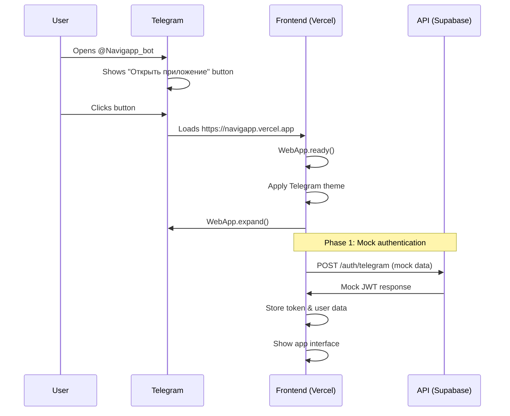
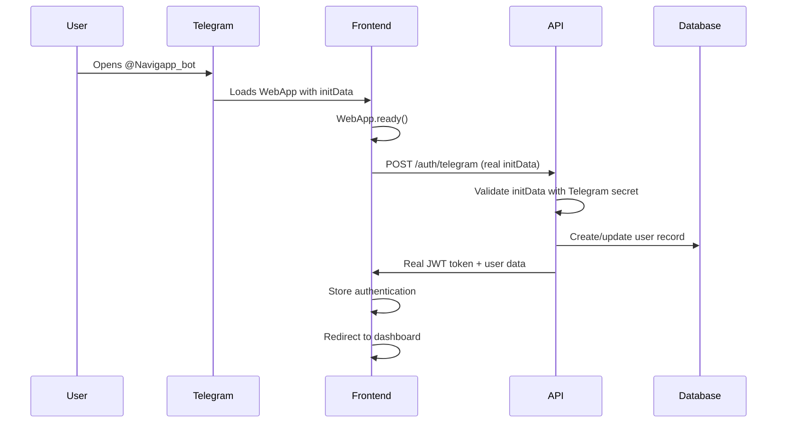

# Telegram WebApp Authentication Flow

**Статус:** ✅ **Phase 1 - Базовая интеграция завершена**

## 🎯 Overview

Navigapp использует официальный Telegram WebApp API для аутентификации пользователей. Это обеспечивает бесшовную интеграцию с экосистемой Telegram без необходимости дополнительной регистрации.

## 🔄 Authentication Flow

### Current Implementation (Phase 1)

```mermaid
sequenceDiagram
    participant U as User
    participant T as Telegram
    participant F as Frontend (Vercel)
    participant A as API (Supabase)

    U->>T: Opens @Navigapp_bot
    T->>T: Shows "Открыть приложение" button
    U->>T: Clicks button
    T->>F: Loads https://navigapp.vercel.app
    F->>F: WebApp.ready()
    F->>F: Apply Telegram theme
    F->>T: WebApp.expand()
    Note over F,A: Phase 1: Mock authentication
    F->>A: POST /auth/telegram (mock data)
    A->>F: Mock JWT response
    F->>F: Store token & user data
    F->>F: Show app interface
```

### Future Implementation (Phase 2)

```mermaid
sequenceDiagram
    participant U as User
    participant T as Telegram
    participant F as Frontend
    participant A as API
    participant DB as Database

    U->>T: Opens @Navigapp_bot
    T->>F: Loads WebApp with initData
    F->>F: WebApp.ready()
    F->>A: POST /auth/telegram (real initData)
    A->>A: Validate initData with Telegram secret
    A->>DB: Create/update user record
    A->>F: Real JWT token + user data
    F->>F: Store authentication
    F->>F: Redirect to dashboard
```

## 🔧 Technical Implementation

### 1. Frontend Integration (✅ Implemented)

**File:** `src/hooks/useTelegramWebApp.ts`

```typescript
import { useEffect, useState } from 'react'

interface TelegramWebApp {
  ready: () => void
  expand: () => void
  close: () => void
  initData: string
  initDataUnsafe: any
  themeParams: {
    bg_color?: string
    text_color?: string
    hint_color?: string
    link_color?: string
    button_color?: string
    button_text_color?: string
  }
  // ... other Telegram WebApp methods
}

export const useTelegramWebApp = () => {
  const [webApp, setWebApp] = useState<TelegramWebApp | null>(null)
  const [isReady, setIsReady] = useState(false)

  useEffect(() => {
    // Check if running in Telegram
    if (typeof window !== 'undefined' && window.Telegram?.WebApp) {
      const tg = window.Telegram.WebApp
      setWebApp(tg)
      setIsReady(true)
    } else {
      // Fallback for development
      console.warn('Not running in Telegram WebApp')
      setIsReady(true)
    }
  }, [])

  return { webApp, isReady }
}
```

### 2. Theme Integration (✅ Implemented)

**File:** `src/App.tsx`

```typescript
useEffect(() => {
  if (webApp) {
    webApp.ready()
    webApp.expand()

    // Apply Telegram theme variables
    const root = document.documentElement
    root.style.setProperty('--tg-theme-bg-color', webApp.themeParams.bg_color || '#ffffff')
    root.style.setProperty('--tg-theme-text-color', webApp.themeParams.text_color || '#000000')
    root.style.setProperty('--tg-theme-hint-color', webApp.themeParams.hint_color || '#999999')
    root.style.setProperty('--tg-theme-link-color', webApp.themeParams.link_color || '#2481cc')
    root.style.setProperty('--tg-theme-button-color', webApp.themeParams.button_color || '#2481cc')
    root.style.setProperty('--tg-theme-button-text-color', webApp.themeParams.button_text_color || '#ffffff')
  }
}, [webApp])
```

### 3. CSS Integration (✅ Implemented)

**File:** `src/index.css`

```css
:root {
  /* Telegram WebApp theme variables */
  --tg-theme-bg-color: #ffffff;
  --tg-theme-text-color: #000000;
  --tg-theme-hint-color: #999999;
  --tg-theme-link-color: #2481cc;
  --tg-theme-button-color: #2481cc;
  --tg-theme-button-text-color: #ffffff;
}

.twa-root {
  background-color: var(--tg-theme-bg-color);
  color: var(--tg-theme-text-color);
  min-height: 100vh;
}

/* Telegram WebApp specific styles */
.tg-button {
  background-color: var(--tg-theme-button-color);
  color: var(--tg-theme-button-text-color);
  border: none;
  border-radius: 8px;
  padding: 12px 24px;
  font-weight: 500;
  cursor: pointer;
  transition: opacity 0.2s;
}

.tg-button:hover {
  opacity: 0.8;
}

.tg-link {
  color: var(--tg-theme-link-color);
  text-decoration: none;
}

.tg-secondary-text {
  color: var(--tg-theme-hint-color);
}
```

## 🔐 Security Implementation

### Current Security (Phase 1)
- ✅ CSP headers настроены для Telegram domains
- ✅ CORS разрешен только для Telegram WebApp
- ✅ X-Frame-Options: ALLOWALL для встраивания

### Enhanced Security (Phase 2)

**Telegram initData Validation:**

```typescript
// Backend validation function (planned)
function validateTelegramInitData(initData: string, botToken: string): boolean {
  const urlParams = new URLSearchParams(initData)
  const hash = urlParams.get('hash')
  urlParams.delete('hash')

  // Sort parameters
  const dataCheckString = Array.from(urlParams.entries())
    .sort(([a], [b]) => a.localeCompare(b))
    .map(([key, value]) => `${key}=${value}`)
    .join('\n')

  // Create secret key
  const secretKey = crypto
    .createHmac('sha256', 'WebAppData')
    .update(botToken)
    .digest()

  // Calculate expected hash
  const expectedHash = crypto
    .createHmac('sha256', secretKey)
    .update(dataCheckString)
    .digest('hex')

  return hash === expectedHash
}
```

## 📱 Telegram Bot Configuration

### Bot Setup (✅ Completed)

**Bot Information:**
- **Name:** Navigapp
- **Username:** [@Navigapp_bot](https://t.me/Navigapp_bot)
- **Token:** `8180571940:AAG8TLcs6ILfmPRFTN9cK14rVl11_n1PSOI`

**WebApp Configuration:**
- **URL:** https://navigapp.vercel.app
- **Title:** Navigapp
- **Description:** Create structured navigation for Telegram
- **Icon:** ✅ Uploaded

### BotFather Commands Used:

```bash
/newbot
# Name: Navigapp
# Username: Navigapp_bot

/newapp
# Select bot: @Navigapp_bot
# Title: Navigapp
# Description: Create structured navigation for Telegram
# URL: https://navigapp.vercel.app
# Icon: [uploaded]

/setmenubutton
# Select bot: @Navigapp_bot
# Button text: Открыть приложение
# WebApp URL: https://navigapp.vercel.app
```

## 🌐 Domain Configuration

### Vercel Headers (✅ Configured)

**File:** `vercel.json`

```json
{
  "headers": [
    {
      "source": "/(.*)",
      "headers": [
        {
          "key": "X-Frame-Options",
          "value": "ALLOWALL"
        },
        {
          "key": "Content-Security-Policy",
          "value": "frame-ancestors https://web.telegram.org https://t.me; default-src 'self'; script-src 'self' 'unsafe-inline' https://telegram.org; style-src 'self' 'unsafe-inline'; img-src 'self' data: https:; connect-src 'self' https://*.supabase.co wss://*.supabase.co;"
        },
        {
          "key": "Cross-Origin-Embedder-Policy",
          "value": "unsafe-none"
        }
      ]
    }
  ]
}
```

### CORS Configuration (✅ Configured)

**Backend (Supabase Edge Functions):**

```typescript
const corsHeaders = {
  'Access-Control-Allow-Origin': '*',
  'Access-Control-Allow-Headers': 'authorization, x-client-info, apikey, content-type',
  'Access-Control-Allow-Methods': 'POST, GET, PUT, DELETE, OPTIONS',
}
```

## 🧪 Testing Authentication

### 1. Development Testing

**Local Development with ngrok:**
```bash
# Start local development
cd frontend && npm run dev

# In another terminal
ngrok http 5173

# Update bot URL in @BotFather temporarily
# Test in Telegram mobile app
```

### 2. Production Testing

**Test in Telegram:**
1. Open [@Navigapp_bot](https://t.me/Navigapp_bot)
2. Click "Открыть приложение"
3. Verify app loads with Telegram theme
4. Check browser console for API calls

**Browser DevTools Check:**
```javascript
// In browser console when app is loaded
console.log('Telegram WebApp:', window.Telegram?.WebApp)
console.log('Init Data:', window.Telegram?.WebApp?.initData)
console.log('User:', window.Telegram?.WebApp?.initDataUnsafe?.user)
console.log('Theme:', window.Telegram?.WebApp?.themeParams)
```

### 3. API Testing

**Mock Authentication (Phase 1):**
```bash
curl -X POST https://zcvaxzakzkszoxienepi.supabase.co/functions/v1/navigapp-api/auth/telegram \
  -H "Content-Type: application/json" \
  -d '{"initData": "test-data"}'
```

## 🔮 Planned Enhancements (Phase 2+)

### Advanced Features
- **Haptic Feedback:** WebApp.HapticFeedback for button interactions
- **Main Button:** WebApp.MainButton for primary actions
- **Back Button:** WebApp.BackButton for navigation
- **Close Confirmation:** WebApp.onEvent('beforeClose') handling
- **Viewport Height:** WebApp.viewportHeight for responsive design

### Security Enhancements
- Real initData validation
- JWT token with expiration
- Refresh token mechanism
- Rate limiting per user
- IP-based protection

### User Experience
- Smooth loading animations
- Telegram-native UI patterns
- Optimized for mobile gestures
- Progressive Web App features

## 📚 References

### Telegram Documentation
- [Telegram WebApp API](https://core.telegram.org/bots/webapps)
- [Telegram Bot API](https://core.telegram.org/bots/api)
- [WebApp JavaScript API](https://core.telegram.org/bots/webapps#initializing-web-apps)

### Implementation Examples
- [Telegram WebApp Example](https://github.com/telegram-mini-apps/telegram-mini-apps)
- [@twa-dev/sdk Documentation](https://github.com/twa-dev/sdk)

### Best Practices
- [Telegram Mini Apps Guidelines](https://core.telegram.org/bots/webapps#design-guidelines)
- [Mobile-First Design for WebApps](https://core.telegram.org/bots/webapps#responsive-design)

---

**Status:** Phase 1 completed - Basic integration working
**Next Steps:** Phase 2 - Real authentication validation and enhanced UX
**Last Updated:** September 2024